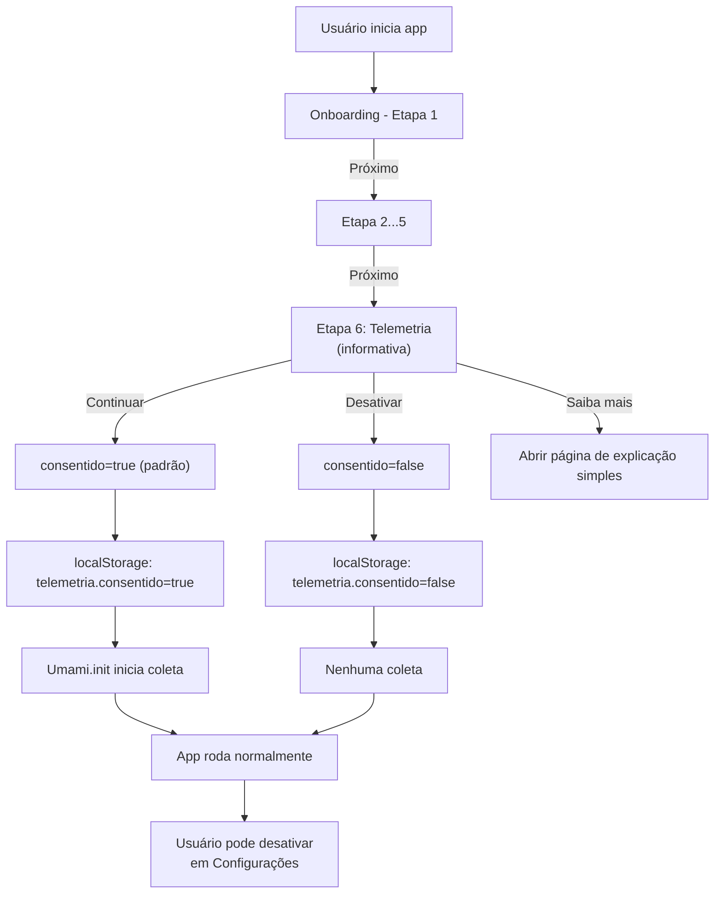

# Fase 8.12 — Telemetria com Umami (ativada por padrão)

> **Status:** Planejamento ✏️  
> **Responsável:** Equipe de desenvolvimento  
> **Sprint alvo:** 2026-04-15 a 2026-05-15  
> **Associado a:** D-06 (DECISOES-EM-ABERTO.md)

---

## 1. Contexto e justificativa

**Problema:** Sem telemetria, não sabemos como usuários realmente usam o Compasso. Desconhecemos padrões de engajamento, drops de onboarding, ou gargalos de usabilidade.

**Restrição:** Compasso é privacy-first. Dados ficam no dispositivo por padrão. Qualquer telemetria externa exige:
- Transparência clara para o usuário
- Opção simples de desativar
- Conteúdo público atualizado nas páginas do app
- ADR aprovada explicando a exceção
- Sem coleta de dados sensíveis (p.ex. valores de consumo, conteúdo de pausa)

**Solução:** Implementar Umami (analytics open-source e privacy-respeitoso) com:
- Telemetria ativada por padrão no onboarding (com informação clara)
- Toggle de desativer/ativar em configurações
- Botão "Saiba mais" levando para página simples de explicação
- Rastreamento anônimo de apenas **5 eventos** iniciais
- Plano free Umami (até 100k eventos/mês)

**Benefício esperado:**
- Entender fluxos de usuário
- Identificar taxas de abandono antes de agir
- Validar hipóteses de design
- Manter privacidade como promessa

---

## 2. Decisão arquitetural (ADR-002)

**Resumo:** Implementar telemetria com Umami (cloud free), ativada por padrão para novos usuários, com dados anônimos, opção de desativar e página "Saiba mais" em linguagem simples.

### 2.1 Justificativa

| Critério | Decisão | Razão |
|---|---|---|
| **Ferramenta** | Umami (cloud) | Open-source, GDPR compliant, sem venda de dados, suporta dados anônimos |
| **Modelo** | Ativada por padrão + desativação fácil | Transparência clara e controle contínuo do usuário |
| **Host** | Cloud gratuito (umami.is) | MVP: sem backend adicional; self-hosted adiciona complexidade |
| **Dados enviados** | Anônimos por sessão | Sem ID de usuário, sem hash de email, sem valores de consumo |
| **Eventos rastreados** | 5 iniciais | Limite para observabilidade sem excesso |
| **Quando coleta** | Padrão para novos usuários | Usuário pode desativar na etapa de onboarding ou em Configurações |

### 2.2 Conformidade

✅ **Privacidade por transparência:** Coleta anônima, com desativação simples e visível.  
✅ **LGPD/GDPR:** Sem ID de usuário; consentimento documentado; usuário pode desativar a qualquer momento.  
✅ **Offline-first:** App continua funcionando sem internet; telemetria não bloqueia fluxo.  
✅ **Posse de dados:** Dados em servidor cloud Umami, sujeito a [Termos Umami](https://umami.is/terms). 

---

## 3. Escopo — 5 eventos

| # | Evento | Descrição | Payload esperado |
|---|---|---|---|
| 1 | `pageview` | Visita de página (rota) | `{ page: "/", title: "Início" }` |
| 2 | `clique_comece` | Usuário clica em "Começar" (onboarding) | `{ step: "onboarding", action: "start" }` |
| 3 | `conclusao_onboarding` | Usuário finaliza onboarding | `{ steps_completed: 7, duration_ms: 240000 }` |
| 4 | `iniciou_pausa` | Usuário inicia pausa programada | `{ metodo: "adiamento", duracao_dias: 7 }` |
| 5 | `registrou_momento` | Usuário registra momento de consumo | `{ intencao: "celebrar", intensidade: "leve" }` |

**Política de dados:**
- Sem valores numéricos de consumo (ex: quantidade bebida).
- Sem conteúdo textual de pausas ou motivos.
- Apenas categorias, estados e timestamps.
- Anônimo: identificador de sessão gerado em primeira carga, não persistido entre desinstalações.

---

## 4. Arquitetura de implementação

### 4.1 Dependências

```json
{
  "devDependencies": {
    "@umami/sdk": "^3.2.0"
  }
}
```

### 4.2 Estrutura de código

```
src/
├── utilitarios/
│   └── telemetria/
│       ├── index.ts (exportações públicas)
│       ├── umami.ts (integração com SDK)
│       └── eventos.ts (tipos de eventos)
│
├── ganchos/
│   ├── useTelemetria.ts (hook para enviar eventos)
│   └── useConsentimentoTelemetria.ts (hook para gerenciar consentimento)
│
├── tipos/
│   └── index.ts (adicionar tipos Configuracoes.telemetria, Evento)
│
├── loja/
│   └── useConfigStore.ts (persistir consentimento)
│
├── paginas/
│   ├── Onboarding/
│   │   └── PaginaOnboarding.tsx (adicionar etapa 6: consentimento)
│   │
│   └── Config/
│       └── PaginaConfig.tsx (adicionar toggle "Permitir telemetria")
```

### 4.3 Fluxo de onboarding e desativação



### 4.4 Inicialização do Umami

**Importante:** Umami só inicia coleta se `consentido === true`.

```typescript
// src/utilitarios/telemetria/umami.ts
import { init, trackEvent, identify } from '@umami/sdk';

const UMAMI_WEBSITE_ID = import.meta.env.VITE_UMAMI_WEBSITE_ID;

export function iniciarUmami(consentido: boolean) {
  if (!UMAMI_WEBSITE_ID || !consentido) {
    console.info('Umami skipped (ID vazio ou consentimento=false)');
    return;
  }

  init({
    websiteId: UMAMI_WEBSITE_ID,
    autoTrack: true, // rastreia pageviews automaticamente
  });
  
  definirIdentificadorSessao();
}

export function enviarEvento(
  nome: string,
  dados?: Record<string, string | number | boolean>
) {
  if (!UMAMI_WEBSITE_ID) return;
  trackEvent(nome, dados);
}

export function definirIdentificadorSessao() {
  // Identificador anônimo de sessão (não persistido)
  const sessionId = gerarUUID();
  identify({ userId: sessionId });
}
```

### 4.5 Tipos TypeScript

```typescript
// src/tipos/index.ts (adicionar a interface Configuracoes)
export interface Configuracoes {
  // ... campos existentes ...
  telemetria?: {
    consentido: boolean | null; // null = ainda sem decisão (usuários antigos)
    ultimaAtualizacao: ISO8601Date;
  };
}

// src/utilitarios/telemetria/eventos.ts
export type EventoTelemetria =
  | 'pageview'
  | 'clique_comece'
  | 'conclusao_onboarding'
  | 'iniciou_pausa'
  | 'registrou_momento';

export interface DadosEvento {
  [key: string]: string | number | boolean;
}
```

### 4.6 Ganchos

```typescript
// src/ganchos/useTelemetria.ts
import { useCallback } from 'react';
import { useConfigStore } from '../loja/useConfigStore';
import { enviarEvento } from '../utilitarios/telemetria/umami';

export function useTelemetria() {
  const { config } = useConfigStore();
  const consentido = config?.telemetria?.consentido ?? true; // padrão: ativado

  const registrar = useCallback(
    (evento: EventoTelemetria, dados?: DadosEvento) => {
      if (consentido) {
        enviarEvento(evento, dados);
      }
    },
    [consentido]
  );

  return { registrar };
}
```

### 4.7 Integração em componentes

**Onboarding (conclusão):**
```typescript
// src/paginas/Onboarding/PaginaOnboarding.tsx
const { registrar } = useTelemetria();
const handleConclusao = async () => {
  const duracao = performance.now() - tempoInicio;
  registrar('conclusao_onboarding', {
    steps_completed: etapas.length,
    duration_ms: Math.round(duracao),
  });
  // ... lógica de conclusão ...
};
```

**Registrar momento:**
```typescript
// src/paginas/Registrar/PaginaRegistrar.tsx (ou hook useRegistro)
const { registrar } = useTelemetria();
const handleSalvarMomento = async (momento: Momento) => {
  registrar('registrou_momento', {
    intencao: momento.intencao,
    intensidade: momento.intensidade,
  });
  await salvarMomento(momento);
};
```

---

## 5. Fases de implementação

### Fase 1: Preparação (Semana 1)

- [ ] Elaborar ADR-002 completa (fechar D-06)
- [ ] Revisar e aprovar com equipe
- [ ] Atualizar a página pública de privacidade: `src/paginas/Privacidade/conteudo.tsx`
- [ ] Atualizar a página de transparência em Configurações: `src/paginas/PrivacidadeTransparencia/PaginaPrivacidadeTransparencia.tsx`
- [ ] Criar conta Umami cloud (umami.is)
- [ ] Gerar `VITE_UMAMI_WEBSITE_ID` em .env.local

**Saída:** ADR-002.md aprovada, .env.local pronto, páginas públicas atualizadas.

### Fase 2: Implementação técnica (Semana 2-3)

- [ ] Instalar `@umami/sdk`
- [ ] Criar `src/utilitarios/telemetria/` (umami.ts, eventos.ts, tipos)
- [ ] Criar hooks `useTelemetria`, `useConsentimentoTelemetria`
- [ ] Adicionar tipos em `src/tipos/index.ts`
- [ ] Inicializar Umami em `src/main.tsx` (condicional a consentimento)
- [ ] Integrar em App.tsx router listener (pageview automático)

**Saída:** Estrutura de código pronta, Umami inicializável.

### Fase 3: UI de consentimento (Semana 3-4)

- [ ] Adicionar etapa 6 em PaginaOnboarding: texto curto e direto sobre telemetria
- [ ] Criar componente `TelemetriaConsent` (explicação + toggle)
- [ ] Criar página "Saiba mais" com explicação simples: quais dados, como usamos e por quê
- [ ] Adicionar rota pública da página "Saiba mais" no roteador
- [ ] Conectar botão "Saiba mais" da etapa 6 para essa página
- [ ] Persistir consentimento em localStorage/Dexie
- [ ] Adicionar toggle "Telemetria" em PaginaConfig > Privacidade
- [ ] Testar fluxos de ativação padrão, desativação e reativação

**Saída:** Onboarding com consentimento, config toggle funcional.

### Fase 4: Instrumentação de eventos (Semana 4)

- [ ] Pageview: integrar via `useTelemetria` no router (automático)
- [ ] Clique "Começar": componente BotaoComecar ou Onboarding
- [ ] Conclusão onboarding: hook useOnboarding
- [ ] Iniciou pausa: hook usePausa
- [ ] Registrou momento: hook useRegistro
- [ ] Validar payloads em staging/dev

**Saída:** 5 eventos rodando em dev, dados sendo enviados para Umami.

### Fase 5: Testes e cobertura (Semana 5)

- [ ] Testes unitários para cada função de telemetria (mocks Umami)
- [ ] Testes integração: fluxos com telemetria ativa, desativada e sem decisão (usuarios antigos)
- [ ] Validar cobertura `> 60%` em `src/utilitarios/telemetria/` e `src/ganchos/useTelemetria.ts`
- [ ] Testes E2E (opcionais): verificar eventos em staging Umami
- [ ] Atualizar baselines de cobertura

**Saída:** Testes passando, cobertura conforme `vitest.config.ts`.

### Fase 6: Documentação e release (Semana 6)

- [ ] Atualizar CHANGELOG.md
- [ ] Documentar como ativar em .env.example
- [ ] Fechar D-06 em DECISOES-EM-ABERTO.md
- [ ] Revisar política de privacidade em produção
- [ ] Gerar release notes (linkando a ADR-002)

**Saída:** Pronto para produção.

---

## 6. Checklist de qualidade

Antes de mesclar para `main`:

- [ ] `npm run type-check` → sem erros
- [ ] `npm run lint` → zero warnings
- [ ] `npm run build` → sem erros
- [ ] `npm run coverage` → `> 60%` (telemetria)
- [ ] Página de privacidade atualizada e revisada (`/privacidade`)
- [ ] Página "Saiba mais" publicada e linkada no onboarding
- [ ] ADR-002 aprovada e documentada
- [ ] Onboarding testado (ativação padrão, desativação, reativação)
- [ ] Configurações: toggle telemetria funcional
- [ ] Eventos sendo enviados para Umami staging
- [ ] Offline-first verificado (app funciona sem internet e telemetria nao bloqueia fluxo)
- [ ] Backwards compatibility: app antigo ainda funciona (`consentido=null` para antigos e `true` para novos)

---

## 7. Impactos

### 7.1 Testes

**Novos arquivos de teste:**
- `__testes__/unitarios/utilitarios/telemetria/umami.teste.ts`
- `__testes__/unitarios/ganchos/useTelemetria.teste.ts`
- `__testes__/integracao/telemetria/fluxo-consentimento.teste.tsx`

**Arquivos modificados (testes):**
- `__testes__/ui/onboarding.teste.tsx` (validar nova etapa 6)
- `__testes__/ui/config.teste.tsx` (validar toggle telemetria)

### 7.2 Cobertura

**Novo baseline esperado:**
- `src/utilitarios/telemetria/`: ~90% coverage
- `src/ganchos/useTelemetria.ts`: ~85% coverage
- Impacto global: +1-2% de cobertura total (locatário depende de código existente)

### 7.3 Performance

**Overhead estimado:**
- Bundle: ~15 KB (minificado, gzipped ~5 KB)
- Runtime: negligenciável (async/non-blocking)
- Sem impacto em offline-first ou startup

### 7.4 Arquivo .env

**Adicione a .env.local (e .env.example):**
```env
# Telemetria Umami (opcional)
# Deixar vazio para desativar coleta. 
# Obtenha em https://umami.is/docs/websites
VITE_UMAMI_WEBSITE_ID=
```

---

## 8. Arquivos a criar/modificar

| Arquivo | Tipo | Descrição |
|---|---|---|
| `docs/decisions/adr-002-telemetria-opt-in.md` | Novo | Decisão arquitetural |
| `src/paginas/Privacidade/conteudo.tsx` | Modificação | Atualizar texto público de privacidade com telemetria |
| `src/paginas/PrivacidadeTransparencia/PaginaPrivacidadeTransparencia.tsx` | Modificação | Adicionar atalho para explicação de telemetria |
| `src/paginas/SaibaMaisTelemetria/PaginaSaibaMaisTelemetria.tsx` | Novo | Página simples: quais dados, como usamos e por quê |
| `src/paginas/SaibaMaisTelemetria/pagina-saiba-mais-telemetria.module.scss` | Novo | Estilos da página "Saiba mais" |
| `src/utilitarios/telemetria/umami.ts` | Novo | Integração SDK |
| `src/utilitarios/telemetria/eventos.ts` | Novo | Tipos e constantes |
| `src/utilitarios/telemetria/index.ts` | Novo | Exportações |
| `src/ganchos/useTelemetria.ts` | Novo | Hook público |
| `src/ganchos/useConsentimentoTelemetria.ts` | Novo | Hook de gerenciamento |
| `src/tipos/index.ts` | Modificação | Adicionar tipo Configuracoes.telemetria |
| `src/main.tsx` | Modificação | Inicializar Umami |
| `src/App.tsx` | Modificação | Router listener para pageview e rota pública `/saiba-mais/telemetria` |
| `src/paginas/Onboarding/PaginaOnboarding.tsx` | Modificação | Etapa 6: consentimento |
| `src/paginas/Config/PaginaConfig.tsx` | Modificação | Toggle telemetria |
| `src/paginas/Registrar/*.tsx` | Modificação | Instrumentar registros |
| `src/loja/useConfigStore.ts` | Modificação | Persistir consentimento |
| `.env.example` | Modificação | `VITE_UMAMI_WEBSITE_ID` |
| `CHANGELOG.md` | Modificação | Registrar mudança |
| `docs/DECISOES-EM-ABERTO.md` | Modificação | Fechar D-06 |
| `__testes__/unitarios/utilitarios/telemetria/*.teste.ts` | Novo | Testes unitários |
| `__testes__/integracao/telemetria/*.teste.tsx` | Novo | Testes integração |

---

## 9. Dependências e bloqueadores

### 9.1 Dependências

- ✅ TypeScript (já presente)
- ✅ React Router (já presente)
- ✅ Vitest (já presente)
- ⏳ Aprovação ADR-002 (bloqueia Fases 2-6)
- ⏳ Conta Umami (cria Website ID para .env)

### 9.2 Bloqueadores

| Bloqueador | Probabilidade | Mitigação |
|---|---|---|
| Aprovação lenta de ADR-002 | Média | Iniciar discussão já na semana 1 |
| Mudanças em política de privacidade não aprovadas | Média | Revisar com legal/compliance ASAP |
| Umami cloud unstable ou sem suporte > 100k eventos | Baixa | Ter alternativa: self-hosted em Heroku/Railway |

---

## 10. Próximas fases (pós 8.12)

- **Fase 8.13:** Telemetria avançada (funis de onboarding, retenção)
- **Fase 8.14:** Exportação de dados analíticos para CSV
- **Fase 9:** Compartilhamento controlado de estatísticas entre usuários
- **Fase 10:** Feedback in-app baseado em telemetria (ex: "97% de usuários completam pausa!")

---

## Referências

- [ADR-001: Product Principles](../decisions/adr-001-product-principles.md)
- [Decisão D-06: Telemetria na Fase 8](../DECISOES-EM-ABERTO.md#d-06)
- [Umami Documentation](https://umami.is/docs)
- [Página pública de Privacidade no app](../../src/paginas/Privacidade/conteudo.tsx)
- [Architecture: Privacy-first](../agents/architecture.md#privacy-first)

---

**Último atualizado:** 28 de março de 2026  
**Versão:** 1.0 (Planejamento)
